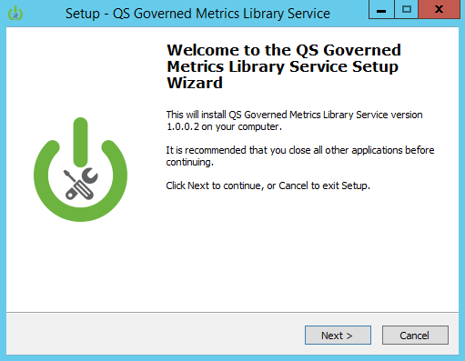
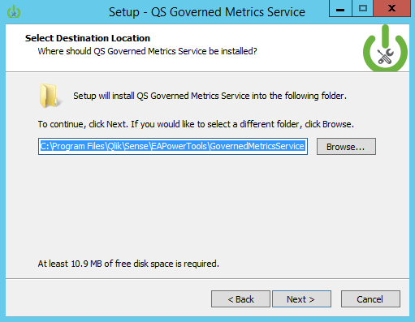

#Governed Metrics Service Installation

To install the Governed Metrics Service, click on this link below.

###[Download Governed Metrics Service Powertool](https://github.com/eapowertools/QSGovernedMetrics)

##Installation Steps

  
  
1. Double click the installation executable downloaded from github. **[Link](https://github.com/eapowertools/QSGovernedMetrics)**  
---
  
2. The Governed Metrics Service install starts and presents the Welcome screen.  
---
  
3. Enter the path corresponding to the location of the service dispatcher service installed by Qlik Sense Server.
---
  
4. If the path exists dialog box appears, this is a good thing!  Please click Yes to continue with the installation. 
---
  
5. The Metrics Library Editor demonstration interface requires Microsoft's 32bit version of the Access Database drivers.  If the 64bit version of the Access Database drivers are already installed, the 32bit drivers will need to be installed using the /passive switch using a command line.  
**[Click here for more information about 32bit and 64bit Access Database driver coexistence on a single system](http://techblog.aimms.com/2014/10/27/installing-32-bit-and-64-bit-microsoft-access-drivers-next-to-each-other/)**.
---
  
6. The component install allows you to install either one or both of the Governed Metrics Service componenets.  The Governed Metrics service **does not** require the Metrics Library Editor in order to run. 
---
  
7. The Ready to Install screen confirms the components that will be installed.
---
  
8. The Installing screen shows the progress for file installation of the Governed Metrics Service.  **This is the last point of the installer where it is possible to cancel the install.**  
---
  
9. The configuration screen for the installer allows you to set the configuration for the Governed Metrics Service REST API.  This includes the following:  

  - **GMS Port:** The TCP port for the GMS REST API.  
  - **Engine Port:** The port the Qlik Engine runs on (default is 4747).  
  - **Repository service port:** The port the Qlik Repository Service API runs on (default is 4242).  
  - **Qlik Sense hostname:** The name of the Qlik Sense server the Governed Metrics Service will run.  This can be a central node or a rim node.  
  - **Metrics Library Application Name:** The name of the application that stores the metrics definitions the Governed Metrics Service will read from to create Master Library entries.  
  - **Metrics Library Custom Property Name:** The name of the custom property containing values that will be applied to applications in a Qlik Sense site that will receive metrics definitions from the Governed Metrics Service.  
  - **Metrics Library Data Refresh Task Name:** The Metrics Library application (name provided above) needs a refresh task so that the Governed Metrics Service may reload the Metrics Library App when updates are made to the metrics.  Enter the name of the task here.

---
  
10. The services.conf file adds the installed applications to run through Qlik Sense Service Dispatcher.  Confirm this path and click Next to add entries to the file.
---
  
11. The installer will stop...

  
12. and then start the Service Dispatcher.
---
  
13. When the installer completes, click the finish button.

##Next Steps
At this point, the Metrics Library Editor (if installed) and the Governed Metrics Service will be running, but are not configured to work with the Qlik Sense Server.  Proceed to the section [Qlik Sense Configuration](qsconfig.md) to configure Qlik Sense and apps to use the GMS.
To access the Metrics Library Editor, open a web browser and navigate to [http://SenseServerHostname:8185](http://SenseServerHostname:8185).

To test the Governed Metrics Service, we recommend using **[Postman](https://www.getpostman.com/)**

More information about using the Metrics Library Editor and Governed Metrics Service is available in the User-Guides.

